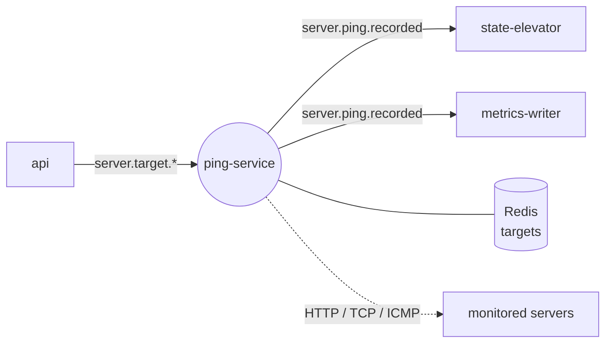

# PingTower Ping Service

Probes every monitored server over HTTP/HTTPS, TCP and ICMP — one goroutine per target.

Stack: Go, RabbitMQ, Redis.

## Role in the system

ping-service is the only component that talks to the outside world. It keeps a scheduler per monitored
server, probes it on the configured interval and publishes every result as a `server.ping.recorded` event.
It knows nothing about statuses or users — deciding whether a server is `UP` or `DOWN` is the job of
`state-elevator`, storing history is the job of
`metrics-writer`.



## Features

- **Four protocols** — `HTTP` and `HTTPS` (status code, DNS lookup time, TLS version, certificate expiry, bytes sent/received), `TCP` (connect time), `ICMP` (RTT min/max, packet loss, TTL via pro-bing).
- **Goroutine per target** — each server gets its own ticker with its `intervalSec` (default 60 s); add/update restarts it, delete stops it.
- **Retries** — a cycle makes `retries + 1` attempts and reports the first success or the last failure.
- **Survives restarts** — targets are persisted to Redis (`<prefix>:…`) and restored on startup, so no events need to be replayed.
- **Resilient publishing** — a pool of publish workers with its own channels, persistent messages, automatic reconnect with a configurable delay.

## Contracts

| Direction | Channel | Name | Payload |
| --- | --- | --- | --- |
| In | queue ← `serverEventsExchange` | `q.ping-service.server-events` (`server.target.added` / `updated` / `deleted`) | `ServerEventPayload` — server + ping settings |
| Out | exchange `pingEventsExchange` | `server.ping.recorded` | `PingRecordedPayload` — success, latency, status code, TLS, DNS, RTT, packet loss… |
| Storage | Redis (db `2`) | `ping-service:*` | last known target configuration |

Full message schemas: `infra/rabbitmq/asyncapi.yaml`.

## Quick start

**Whole stack** — via `infra` (all repos cloned side by side):

```bash
make -C infra up
```

**This service only** (broker and Redis already running from infra):

```bash
cp .env.example .env
docker compose up -d --build
```

**Local development:**

```bash
go run .      # reads .env from the working directory
go test ./...
```

## Structure

```text
ping-service/
├── main.go               # wiring, consume loop, routing-key dispatch
└── internal/
    ├── config/           # env / .env loading
    ├── messaging/        # RabbitMQ consumer, publisher pool, reconnects
    ├── models/           # event payloads
    ├── pinger/           # HTTP(S), TCP and ICMP probes
    ├── scheduler/        # per-target goroutines, retries
    └── targetstore/      # Redis persistence of targets
```
